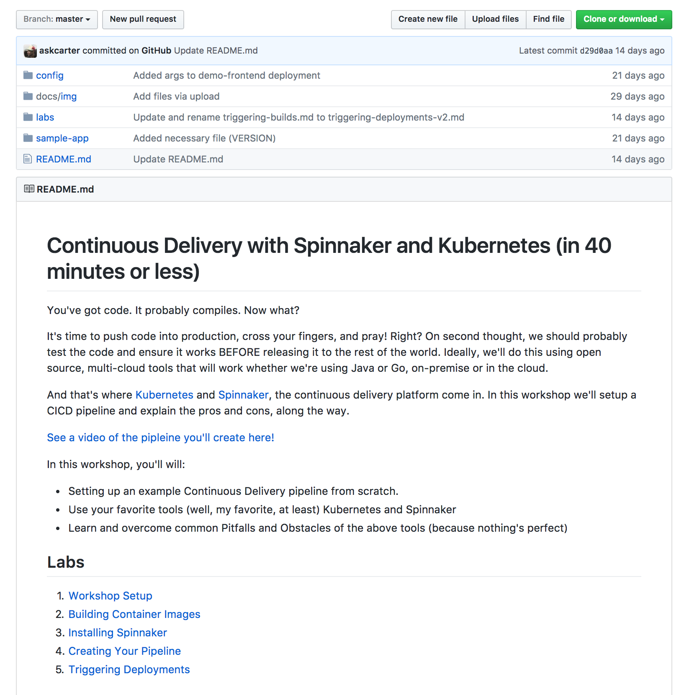

It can be hard to know what makes a good workshop. How do you design a workshop in a way that makes it easy for users to follow along and provides natural checkpoints so that everyone is one the same page? We can design labs (or discrete learning points) to take into account how people learn and how workshops are generally taught.

Another issue is collecting feedback about the workshop. Was the workshop useful? Was it everything it promised to be? What else should I have included? The easiest way to answer that is by running surveys and making them an OPTIONAL step in the workshop.

> **Note:** The first section of your github workshop is the 'abstract'. It tells users the benefits of running through your workshop and provided any additional resources they may need, if your workshop isn't for them. Often times I'll even include a link to a video or picture emphasising this point.  

Here's an example:
> 

Lastly, the biggest factor determining if a workshop will be successful is preparation. Before you run the workshop, run through it a few times (using the same setup a user would) yourself as well as someone else. Most of my bad workshops came down to lack of preparation.

## Labs

1. [Workshop Setup](labs/workshop-setup.md)
1. [Lab 1](labs/lab-template.md)
1. [Lab 2](labs/lab-template.md)
1. [Lab N](labs/lab-template.md)
1. [Workshop Wrap Up](labs/workshop-wrapup.md)

> **NOTE:** Setting up labs this way makes it really easy for a workshop presenter to say, "Everyone, we're going to run through the Workshop Setup now." Then, after explaining the lab, and while everyone else is running through it, you can go around and help atttendees that need additional help.

Remember to encurrange people to give feedback, either by making issues on your repository or by taking a survey after the course.

## What Next?

If this lab was too advanced, you might want to check out:
* Link to pre-requisite content

If this lab was too simple or you completed it (like a boss):
* Link to follow-up content

> **Note:** Have a discrete place for pointing users to if this lab isn't for them OR for once they've completed it.  

## Resources

* Kelsey Hightower's [Kubernetes 101 Workshop](https://github.com/kelseyhightower/craft-kubernetes-workshop) is the best example I've seen of this format.
